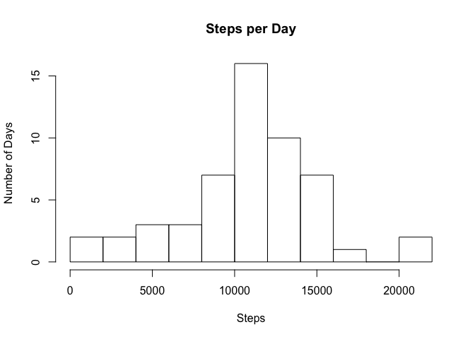
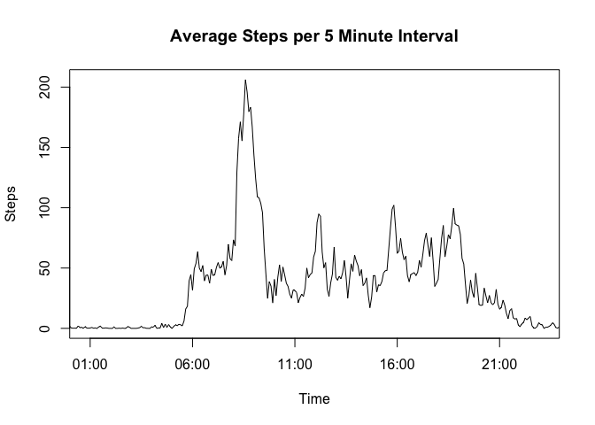
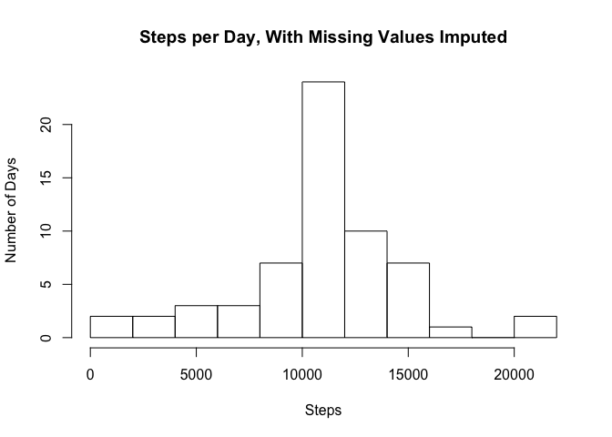
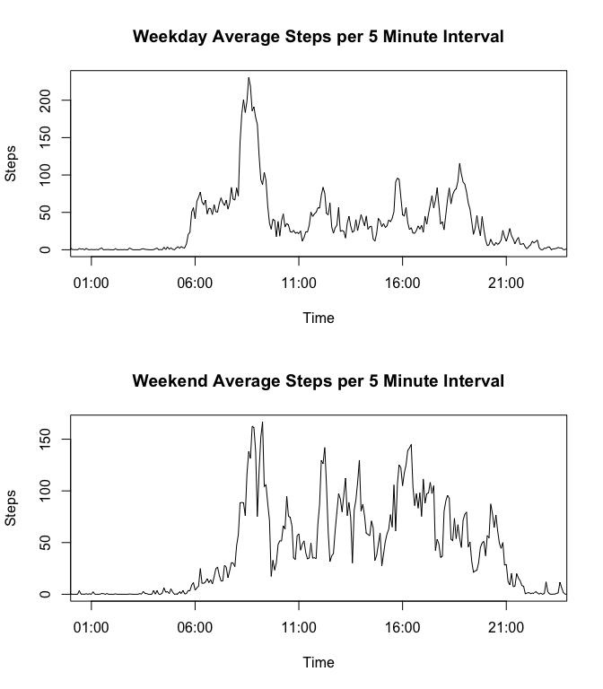

# Reproducible Research: Peer Assessment 1

##BACKGROUND
This document, including the md, html versions, along with a directory of figures, are intended to provide the required information needed for a peer assessment for this 1st project (Peer Assessment) in the course: Reproducible Research. For conveniese of the review, I've also provide a pdf of the html document.

You may notice in graphs, where we have been asked to plot interval on one axis, I have chosen to plot time instead of interval. This distinction may seem minor, but the values of interval jump from xx55 to xx00 every hour, and this makes graphs using the interval variable to appear to have data where none exists (values corresponding to intervals xx60, xx65, xx70, xx75, xx80, xx85, xx90, and xx95).

##Loading and preprocessing the data
###Course instructions are:

- Show any code that is needed to

- Load the data (i.e. read.csv())

- Process/transform the data (if necessary) into a format suitable for your analysis. 

###My response:
For this task of the assignment, I read the data and make an assessment of its format and completeness. As instructed in the assignment, I forked and then cloned the repository "http://github.com/rdpeng/RepData_PeerAssessment1". Note that this document was authored from the file 'PA1_template.Rmd', also co-located in the forked/cloned repository. I unzipped the data file "activity.zip" and copied it into my local repository, and this is the file I work with below, "activity.csv".

I read the data into a data frame variable "adata"" for investigation.

```r
adata <- read.csv("activity.csv")
```

Note that I use functions of the dplyr and lubridate packages, so I load 'dplyr' and 'lubridate here.


```r
library(dplyr)
```

```
## 
## Attaching package: 'dplyr'
## 
## The following object is masked from 'package:stats':
## 
##     filter
## 
## The following objects are masked from 'package:base':
## 
##     intersect, setdiff, setequal, union
```

```r
library(lubridate)
```

To help understand the nature of the data, here are a few rows of adata, along with the structure of adata:

```r
print(adata[1:5,])
```

```
##   steps       date interval
## 1    NA 2012-10-01        0
## 2    NA 2012-10-01        5
## 3    NA 2012-10-01       10
## 4    NA 2012-10-01       15
## 5    NA 2012-10-01       20
```

```r
print(adata[2410:2415,])
```

```
##      steps       date interval
## 2410   613 2012-10-09      845
## 2411   530 2012-10-09      850
## 2412   655 2012-10-09      855
## 2413   134 2012-10-09      900
## 2414     0 2012-10-09      905
## 2415     0 2012-10-09      910
```

```r
print(str(adata))
```

```
## 'data.frame':	17568 obs. of  3 variables:
##  $ steps   : int  NA NA NA NA NA NA NA NA NA NA ...
##  $ date    : Factor w/ 61 levels "2012-10-01","2012-10-02",..: 1 1 1 1 1 1 1 1 1 1 ...
##  $ interval: int  0 5 10 15 20 25 30 35 40 45 ...
## NULL
```
You may Notice the interval information in the rows 2410:2415 in 'adata', which show the problem I discussed earlier on background, that intervals don't have values within each hour for the vales xx60 to xx95. I fix this later creating time vector stored this in the variable ti. 

The data is straight forward. There are two months worth of data, with no missing intervals or days, and the intervals reflect the number of steps for 5 minute each (steps are shown in the steps column), 24 hours per day, 61 days. However, there are missing step values for 8 days. You can see some of the missing values (NAs) shown for the steps column in the first few rows above (rows 1 through 5).

I first get a time vector to use instead of interval. I create a new variable called 'ti' (time interval), of form POSITlt. For readiblity, I create some temporary variables for extracting the date, hours, and seconds from the dataset. I used the first days values for 'interval' in the data set 'adata' to create the 'ti' vector.


```r
ti <- matrix(data = NA, nrow = 288)
h1 <- adata$interval[1:288] %/% 100 # (integer divide to get hours)
m1 <- adata$interval[1:288] %% 100  # (modulus divide to get minutes)
f1 <- "%H %M"                       # Format to be used to convert to POSTlt
ti <- strptime(paste(h1, m1), f1)
```

##What is mean total number of steps taken per day?
###The course instructions are:
- For this part of the assignment, you can ignore the missing values in the dataset:

- Calculate the total number of steps taken per day

- If you do not understand the difference between a histogram and a barplot, research the difference between them. Make a histogram of the total number of steps taken each day

- Calculate and report the mean and median of the total number of steps taken per day

###My response:
For this step, I create 4 subsets of the data. First, I subset adata into two variables, one without NAs, and one only with NAs, and these are in data frames 'nonad', and 'nad'. I then to create two more data frame variables from the NA free data (nonad), one is 'nonad' regrouped by date (gd_nonad),is a variable containing the number of steps summed for each day (sdm_nonad). I exploit the 'dplyr' functions 'group_by' and 'summarize' to ease this process.


```r
nonad <- adata[!is.na(adata$steps),]
nad <- adata[is.na(adata$steps),]
gd_nonad <- group_by(nonad, date)
dsm_nonad <- summarize(gd_nonad, dssteps = sum(steps))
```

For the histogram of the daily steps, I force 12 breaks, as it gives pretty nice bin size. I then compute the average (mean) and median number of steps for all days, and report them, along with the number of NA rows that were found. I convert the mean steps per day to in integer for readibility.


```r
hist(dsm_nonad$dssteps, breaks = 12, xlab = "Steps", ylab = "Number of Days", main = "Steps per Day")
```

 

```r
avg_dsm <- as.integer(mean(dsm_nonad$dssteps))
mdn_dsm <- median(dsm_nonad$dssteps)
```

The mean steps per day are: 10766

The median steps per day are: 10765

##What is the average daily activity pattern?
###The course instructions are:

- Make a time series plot (i.e. type = "l") of the 5-minute interval (x-axis) and the average number of steps taken, averaged across all days (y-axis)

- Which 5-minute interval, on average across all the days in the dataset, contains the maximum number of steps?

###My Response:
The first step is to create a data frame containing the mean interval values for all days. To do this, I first create a new data frame from the nonad data frame, grouped by interval (gi_nonad. I then create the resulting data frame with the mean steps for each interval (imn_nonad). Finally, I plot this data, using the mean interval steps ('misteps' in 'imn_nonad' (y axis), against time 'ti' (x axis)).


```r
gi_nonad <- group_by(nonad, interval)
imn_nonad <- summarize(gi_nonad, misteps = mean(steps))
# plot(ti, imn_nonad$misteps, type = "l")
plot(ti, imn_nonad$misteps, type = "l", ylab = "Steps", xlab = "Time", main = "Average Steps per 5 Minute Interval", xaxs = "i")
```

 

The second step is to determine the 5 minute interval with the largest (maximum) average number of steps. I use the R function 'which.max to do this, then collecting both the hour and minute values for the maximum value, pasting them together with a ':' seperator, and storing the result in 'max_int' (maximum interval). I then also get the value at that interval and store it in 'max_val'.

```r
which_int <- which.max(imn_nonad$misteps)
max_int <- paste(hour(ti[which_int]), minute(ti[which_int]), sep = ":")
max_val <- as.integer(imn_nonad$misteps[which_int]) 
```

The maximum average interval was at: 8:35, with a value of 206 steps.

##Imputing missing values
###The course instructions are:

- Note that there are a number of days/intervals where there are missing values (coded as NA). The presence of missing days may introduce bias into some calculations or summaries of the data.

- Calculate and report the total number of missing values in the dataset (i.e. the total number of rows with NAs)

- Devise a strategy for filling in all of the missing values in the dataset. The strategy does not need to be sophisticated. For example, you could use the mean/median for that day, or the mean for that 5-minute interval, etc.

- Create a new dataset that is equal to the original dataset but with the missing data filled in.

- Make a histogram of the total number of steps taken each day and Calculate and report the mean and median total number of steps taken per day. Do these values differ from the estimates from the first part of the assignment? What is the impact of imputing missing data on the estimates of the total daily number of steps?

###My Response:
The first item is to computer the number of rows with missing values. This is just the length of the data frame I created earlier, nad.

```r
miss <- length(nad$steps)
```
The total number of missing rows are: 2304

The second step is to devise a stategy for filling in all of the missing values. For this, I am choosing to simply replace each missing row step value with the average value for that interval from the data computed above, stored in the data frame 'imn_nonad'. 

I start by creating a new data frame 'nadnew', copied from nad. I then copy into it the rounded values of the average step values from 'imn_nonad' (also converted to integer for consistency). There are two major assumptions with this copying activity. The data frame being copied into (nadnew) is ordered by interval for each day, and there is an integral number of total rows of 'imn_nonad' relative to 'newnad'. We know that this is the case from examination of the data we performed earlier (8 days, 24 hours, 12 intervals per hour, is 2304 rows).

The newly updated dataset 'nadnew' is then bound with the existing 'nonad' data set (rbind) and stored in a new data frame 'bdata'. This new data frame contains all the rows of the original data frame (adata), but now with the rows with missing step values (NAs) imputed to contain the averages.


```r
nadnew <- nad
nadnew$steps <- as.integer(round(imn_nonad$misteps),0)
bdata <- rbind(nonad, nadnew)
```

From this, I recreate a histogram, exactly as before, but now use bdata (the data set with the imputed step values). Note that I use the same technique as earlier, but with bdata instead of nonad, creted a new data set grouped by day, and then computing the number of steps for each day. I also calculate the new mean and median number of steps.


```r
gd_bdata <- group_by(bdata, date)
dsm_bdata <- summarize(gd_bdata, dssteps = sum(steps))
avg_dsmb <- as.integer(mean(dsm_bdata$dssteps))
mdn_dsmb <- median(dsm_bdata$dssteps)
hist(dsm_bdata$dssteps, breaks = 12, xlab = "Steps", ylab = "Number of Days", main = "Steps per Day, With Missing Values Imputed")
```

 

The mean steps per day (with imputed values added) are: 10765

The median steps per day (with imputed values added) are: 10762

The new histogram is nearly identical to the original, except that the bin at around 10000 steps is 8 days (frequency) taller. This is a direct result of the method of imputation we used. The recomputed average is almost identical to the originally computed value, 10765 (new) versus 10766 (old), but the average for the added days (imputed) were slightly lower (about 4 steps on average). This difference is accounted for in the rounding error of the imputed values (I converted them to integers).

The median changed, 10762 (new) versus 10765 (old). The new median value has moved lower, reflecting the effects of imputing the missing values. In this case, rounding and converting the interval means to integers (for the imputed days and rows) moved the median value to match the imputed daily average, which as IO said early, is sligtly lower than the overall daily average (again, an artifact of rounding and converting to integer). 

##Are there differences in activity patterns between weekdays and weekends?
###The course instructions are:

- For this part the weekdays() function may be of some help here. Use the dataset with the filled-in missing values for this part.

- Create a new factor variable in the dataset with two levels – “weekday” and “weekend” indicating whether a given date is a weekday or weekend day.

- Make a panel plot containing a time series plot (i.e. type = "l") of the 5-minute interval (x-axis) and the average number of steps taken, averaged across all weekday days or weekend days (y-axis). See the README file in the GitHub repository to see an example of what this plot should look like using simulated data.

###My Response:
As suggested, I used the dataset (bdata) created with the imputed missing values. As start by creating a new vector 'we', which is the boolean evalatuion of the date in each row as to whether that date is on a weekend or not. TRUE means that date is either a "Saturday" or a "Sunday", otherwise its FALSE, meaning it is a weekday. I then use the 'we' logical vector to add a column 'we' to the bdata data set, setting the value to 'weekend' or weekday, depending upon the boolean 'we. I then convert the 'we' column to to be a factor.

I then group the data by interval, similar to what has been done in earlier examples of this analysis. I then summarize the mean (based on 'interval') steps for each group (weekday or weekend), using the 'dplyr' function 'filter' to subset the two cases. I store the weekday and weekend mean interval data into two vectors, 'westeps' for weekend data, and 'wdsteps' for weekday data. I then plot the two sets of data in a panel of two plots for review.


```r
f1 <- "%Y-%m-%d"       # Format to be used to convert to POSTlt
we <- weekdays(strptime(bdata$date, format = f1)) == "Saturday" | weekdays(strptime(bdata$date, format = f1)) == "Sunday"
bdata$we[we] <- "weekend"
bdata$we[!we] <- "weekday"
bdata$we <- as.factor(bdata$we)
gbi_bdata <- group_by(bdata, interval)
westps <- summarize(filter(gbi_bdata, we == "weekend"), isteps = mean(steps))
wdstps <- summarize(filter(gbi_bdata, we == "weekday"), isteps = mean(steps))

par(mfrow = c(2,1)) 
plot(ti, wdstps$isteps, type = "l", ylab = "Steps", xlab = "Time", main = "Weekday Average Steps per 5 Minute Interval", xaxs = "i")
plot(ti, westps$isteps, type = "l", ylab = "Steps", xlab = "Time", main = "Weekend Average Steps per 5 Minute Interval", xaxs = "i")
```

 

Examination of the two plots shows that weekend activity has fewer steps in the morning, but is more noisy and perhaps higher in the afternoon, compared to weekday activity.
